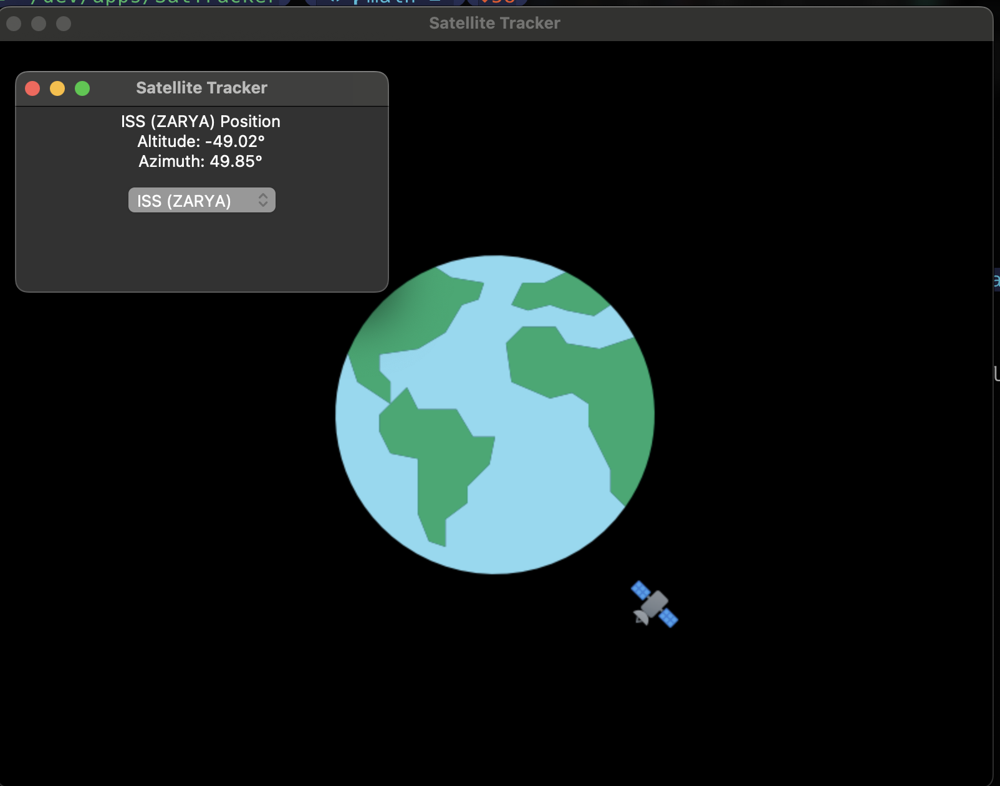

# Satellite Tracker

A Python application that tracks the position of satellites and provides a 2D visualization using Tkinter and Pygame.

## Features

- Get the user's location using their IP address
- Select a satellite from a list of available options
- Display the selected satellite's altitude and azimuth
- 2D visualization of the Earth and the selected satellite's position
- Real-time updates of the satellite's position

## Prerequisites

- Python 3.x
- Tkinter (usually included with Python)
- Pygame
- Skyfield
- geocoder

## Usage 

1. Clone the repository
2. pip install -r requirements.txt
3. run the 'satTrack.py' script
